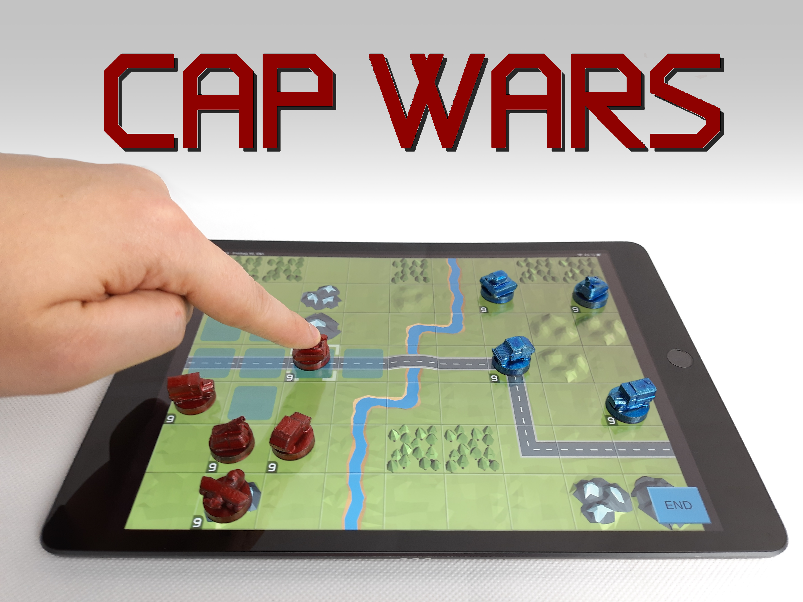
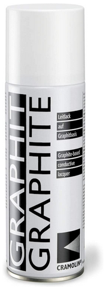
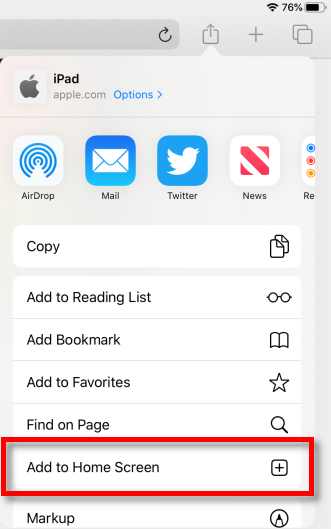

# Cap Warrior

 

## Introduction
Cap Wars is an *Advance Wars* like strategy game that is played with 3D printed pawns on a tablet. The pawns need to be coated with graphite in order to interact with the touchscreen.

You can watch this video for a quick overview of the game and the process required to create the pawns:  
  
*[YouTube link](https://youtu.be/SLH1cwr5F_g)*

## Making the pawns
Go to the STL Folder of the repo and print all units (everything except the 2 holder pieces) twice. You should print with a **1.2 mm Layer height** and **without supports**. 

If you want you can also print the 2 holder pieces to have a nice box for your pawns.

After printing the pawns you need to coat them with graphite to make them conductive and interact with the touchscreen of your tablet. You should apply at least 2 coats. I tried **a lot** of different coatings up in the end only graphite spray worked really well. I used this spray:

  
*[Amazon link](https://www.amazon.de/gp/product/B00OG1LI1O)*

After coating the pawns with graphite you can paint or spray them with a thin layer of paint. You should use a thin and very opaque paint for this. In my experience metallic colors work best for this.

## Start the Game
The game is played on a browser on your tablet. No app from the app store is required. You can start the game with the following link:

## [--> Start Game <--](https://sakati84.github.io/CapWarrior/index.html)

If you want to play in **Fullscreen** on your iOS device you need to create a shortcut to the game with:

When you start the game through the new icon added to your home screen it should run in fullscreen mode.

## Playing the Game
The game is pretty similar to *Advance Wars* or other turn based strategy games. After starting a game and selecting a map you need to place your pawns on the touchscreen. Hit "End" to end the troop deployment and start the game. The currently active unit and it´s movement range is highlighted. Move your unit and select a unit to attack by tapping on it. End your turn and start attacking the enemy unit by tapping "End".

> **The game is still under development and mainly intended to demonstrate a cheap and easy way to produce 3D printed pawns for touchscreen interaction. It is not intended to be a AAA gaming experience or anything like that.**
